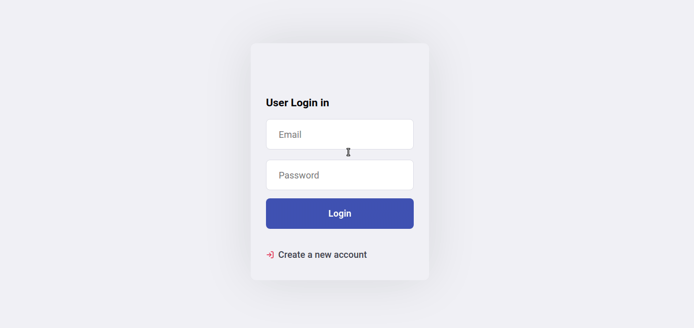

<h2 align="center"> login-register-webApp</h2>

## :gear: Technologies
- [Node.js](https://nodejs.org/en/)
- [React](https://reactjs.org)
- [jwt-simple](https://www.npmjs.com/package/jwt-simple)
- [PassportJS](http://www.passportjs.org/)
- [dotenv](https://www.npmjs.com/package/dotenv)
- Yup
- [Formik](https://jaredpalmer.com/formik)
- [Material-ui](https://material-ui.com/)
- [Mysql](https://www.mysql.com/)

## :checkered_flag: To run the project:
1. Make a clone (`git clone`) of this repository;
2. Enter the `cd login-register-webApp` folder;

## Backend
1. Enter the `cd server` folder;
2. Run `yarn` to install the dependencies;
3. Copy `.env.example` to `.env` and update
4. Run `yarn start` to start the server.

## Web 
1. Enter the `cd front` folder;
2. Run `yarn` to install the dependencies;
3. Run `yarn start` to start the server.

